# Creating a 2D Multiplayer Racing Game

Source: [github](https://github.com/Bvanderwolf/MultiplayerRacing/tree/master/MultiplayerRacer/Assets)

How do I create a 2d multiplayer racing game with lag and packet loss compensation and desync-avoidance? To find this out I will take a look at the Photon Unity3D Networking Framework and create a project using Photon for the Unity Engine, to research this very topic.

During this project I will research various industry examples and/or documentation to find my own optimal solution to the problems I will face making this application.

I will try to implement my own synchronization code based on the research done and document the process and the things I found out. In the last chapter I will explain my own solution and try to argue why I think it is the optimal solution for my use case.

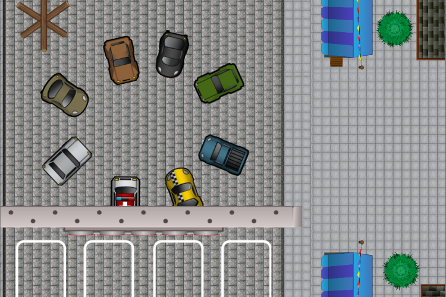

## Setting up the project

Before I can start my research I will have to set up my project with the Photon Unity3D Networking Framework. Since this is not the main focus of my report I will try to spend as little time as possible on this. To actually get to a context where players, steering their cars, will have to synchronize the cars on their client with the other’s, I will first have to do some setting up:

```c#
PhotonNetwork.ConnectUsingSettings();
PhotonNetwork.ConnectToMaster("address", 0, "appId");
PhotonNetwork.ConnectToBestCloudServer();
PhotonNetwork.ConnectToRegion();
```

The first option (and the one I’m using) uses a scriptable object called PhotonServerSettings to connect to a Photon Server based on settings configured in that scriptable object. The second option gives you the option to fill in a specific master server address, a port and your app ID for verification. The app Id is related to the Photon Project from which you are making the call. The 3th option connects you to the best Photon cloud server based on ping and the fourth gives you an option to connect to a Photon cloud server in a given region.
Facilitating connecting to Master in a unity scene, I did with a simple “Connect to Master” Button


## Connecting to a Room

The second step is that you connect to a room. In a room is where you start connecting with players, sending data back and forth. There are 4 ways to connect to a room. Here are all 4 in code:

```c#
PhotonNetwork.JoinOrCreateRoom(ROOM_NAME, options, TypedLobby.Default);
PhotonNetwork.JoinRandomRoom();
PhotonNetwork.JoinRoom(ROOM_NAME);
PhotonNetwork.CreateRoom(ROOM_NAME, options);
```

The first option (and the one I’m using) tries joining a room with a given name, room options and lobby type and creates one if there isn’t one already. The second option tries joining a random available room. The third option joins a room with given name and the 4th and last option creates a room with given name and given room options. Joining a room will fail if no rooms have been made yet. This is why I use the first option so I will always have a guaranteed room even if none has been made already.

Facilitating connecting to a Room, I did by updating the “Connect to Master” button to a “Connect to Room” button when connecting to master was successful.

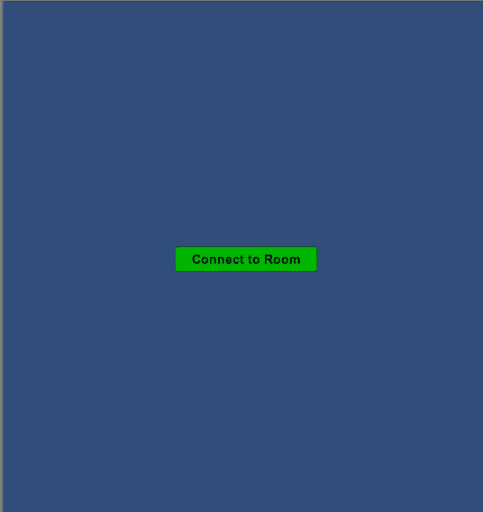

## The Room process

When inside the room, there needs to be a way to start the game. There needs to be a definition as to when the game can be started and there also needs to be some sort of authoritative client to actually make the call to start the game.

Looking at how a lot of games handle this room setup scenario I think I will follow the lead by introducing ready buttons for each player to communicate their ready status to others. When the last player to ready up has done this, there needs to be the authoritative client to check if all players have readied up or not.

Instead of having a server-client model, Photon provides a master client option, for developers to give additional rights to or give authoritative power. In this room setup scenario, I decided that It would be the master client to check on the ready status of all players and to decide on whether to start the game or not.

Facilitating this I added, for each player, a player info item with a ready button. Players can also see, in the top left corner, information on the room they are in.

**One player inside room**
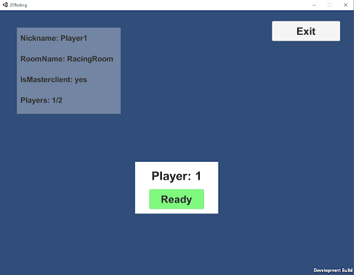

**Two players inside room**
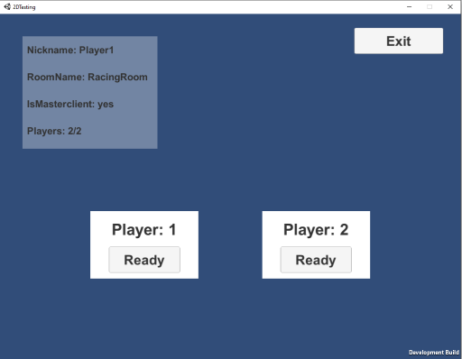

Wanting to visualize the process from opening the application to actually starting the game, I created some diagrams.

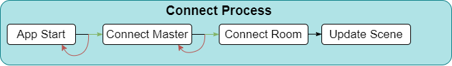

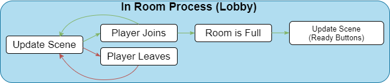

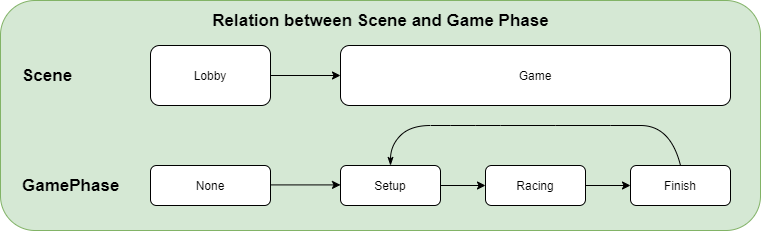

## Researching industry examples

The first big company that I found had some interesting information on Multiplayer Networking was Valve. They had 2 interesting pages which included a lot of documentation on their “Source” engine and its networking, going very much in depth about tick rates and lag compensation. I found a GDC talk by Glenn Fiedler, also known as Gaffer On Games which included a lot of basic knowledge on the different categories of synchronizing objects and optimizing networking especially related to Physics.

**Valve their Source engine**

On their documentation page about their software they give a short definition of what a server is. “Usually a server is a dedicated host that runs the game and is authoritative about world simulation, game rules and player input processing” (Bernier, 2019). Communication is done by sending small data packets at a high frequency. The clients receive the current world state and generate video and audio output based on these updates. The server receives sampled inputs from the clients so it can process these for a new world state update.

Important to note here is that this description relates to a Client-Server networking architecture. In this architecture, clients only communicate with the server and not with each other. A peer-to-peer application would facilitate this (Bernier, 2019).

Making this work is hard because of the following reasons:

- Network bandwidth is limited, so the server can’t send a new update packet to all clients for every single world change.
- Network packets take a certain amount of time to travel between the client and the server. This means that the client is always a little bit behind the server time.
- Client input packets are, because of reason 2, delayed on their way back. This means the server is always processing temporally delayed user commands.
- Each client has a different network delay which varies over time due to other background traffic and client’s framerate.
- Issues like lag (where packets take longer than normal to travel), packet-loss (where some packets don’t reach the destination) and jitter (where time between packets varies a lot) can cause strange effects to normally smooth gameplay.

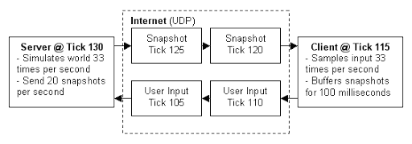

Making this work is hard because of the following reasons:
- Data compression (reducing data footprint when sending, reconstructing it when delivered)
- Lag compensation

The client can then use predictive measures (for example extrapolating) and interpolation to improve the experience for the player.

In his chapter about Entity Interpolation Bernier goes in depth as to how the interpolation is done exactly. Since snapping entity states to a given world state would look choppy and jittery (visualized when implementing my own code), clients go back in time for rendering, so positions and animations can be continuously interpolated between two recently received snapshots.

In a scenario where you receive 20 snapshots per second, a new update arrives about every 50 milliseconds ((1 second / 20) x 1000). If the client render time is shifted back 50 milliseconds, entities can always be interpolated between the last received snapshot and the snapshot before that.

In the “Source” engine, the client buffers snapshots based on a constant interpolation period value. This constant value defaults to 100 milliseconds. This means that even if a snapshot is lost. The client can still linearly interpolate between the snapshot before the one it lost (in the buffer) and the one received after the one it lost.

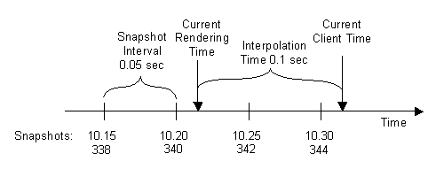

## Gaffer On Games GDC Talk

Glenn Fiedler, the founder and CEO of Network Next, Talked during his GDC talk about Networking for Physics programmers. My 2D multiplayer Racing Game uses a lot of physics with car interaction and control, the things he talks about are very relevant to my project. The talk contains a lot of information of which not all is used for my own networking code. Despite that, the information that was relevant really helped bring my project further. The things I was most interested in in his talk was his explanation of the Three Techniques for network synchronization that he distinguishes: Deterministic lockstep, Snapshot interpolation and State Synchronization.

**Deterministic Lockstep**

Deterministic lockstep is used a lot in real time strategy games where inputs generated on one computer are always the same as on another computer (Fiedler, 2018). This means that the computer’s hardware doesn’t determine the outcome of the input. There are no dependencies there. A low budget computer gives the same result as a high budget one. When a developer chooses to use deterministic lockstep, he only sends and receives player input (for example keyboard input). These inputs can then be used on the client to simulate the behaviors associated with these inputs. This method doesn’t use a lot of bandwidth but requires the game to be deterministic to the byte level.

**Snapshot Interpolation**

Developers using snapshot interpolation send, in their snapshots, the necessary states that describe an entity in the world. This would mean for a car its position and orientation, and maybe even its velocity. Other clients receiving these states can then interpolate between the states in their scene and the states received in the snapshot. The other clients are interpolating between snapshots. This method is very robust but costs a lot of bandwidth (Fiedler, 2018).

**State Synchronization**

State synchronization is a method where you as a developer make use of both input and states that describe an entity. With this, you don’t require determinism because you have, alongside the inputs for the simulation, a state to which interpolation can be done to fix problems up (Fiedler, 2018).

## Implementing my own synchronization code

Having looked extensively at research on the topic of multiplayer networking I can now create and test my own code in the Unity Game Engine using the Photon Unity3D Networking Framework. Before I can start writing my own code I have to set up my scene and cars to facilitate this.

I created a road on which players can drive their cars and imported some simple car sprites to represent each player’s car.

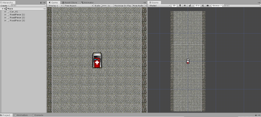

I will start off by indicating the remote state of the car (i.e. the last snapshot state I received) as a red marker (I can later change this to a more transparent version of the car).

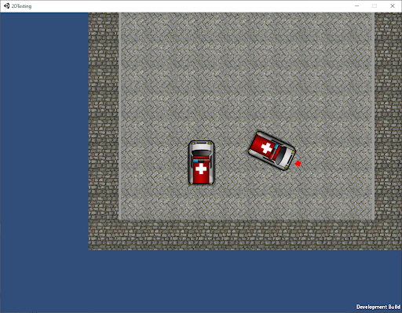

I need to test out a lot of different things to eventually get to something I can be proud of and know to be working well. I have to take into account many things when writing my code. My cars make use of a rigid body component to move around and interact with their surroundings. This rigid body component places the car under the control of the physics engine. Since the physics engine produces non deterministic results all the time (Fiedler, 2018), I will have to take this into account when writing my code.

## Snapping to newly received snapshots

Knowing why just snapping to a newly received snapshot is not the way to go is always handy.

```c#
RB.position = removePosition;
RB.rotation = removeRotation;
```

**Without lag**


**With lag**
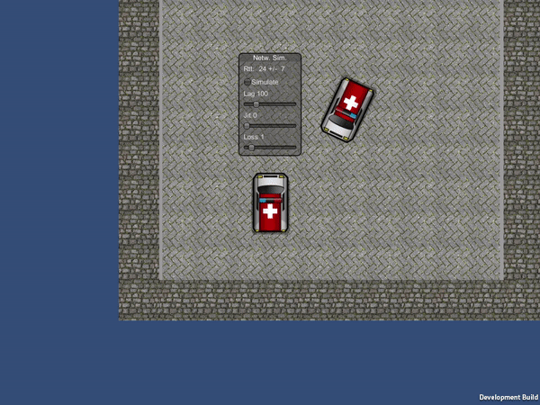

## Deterministic lockstep

Sending only player inputs in the context of my game would be to send vertical and horizontal axis inputs (for controlling the car). Doing this, the car movement actually looked pretty good. However, the remote car (shadow car) would come into view a lot, meaning it got out of sync. This was especially true when I started increasing the amount of lag. Also, everything works well until collisions happen and the physics system with its non-determinism creates difference on both clients.

**Sending only vertical input**


**Sending horizontal and vertical input**


## Snapshot interpolation

Just interpolating towards the new state of the remote car could also be an option. If I don't simulate anything on my computer and just look at the state that is given to me each snapshot, there won’t be any errors related to non-determinism of the physics engine.

```c#
RB.position = Vector2.Lerp(RB.position, remoteposition, Time.deltaTime);
```

**Without lag**
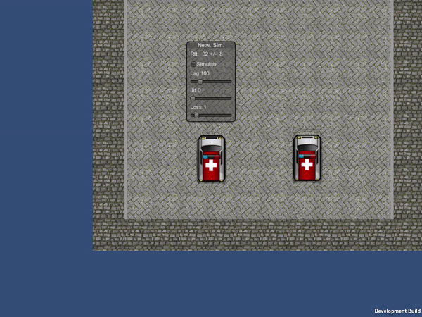

**With lag**
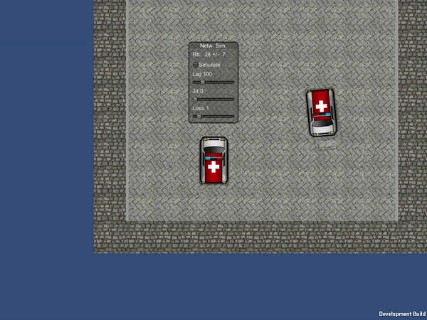

Looking at the movement of the car, it is smooth. Sadly enough it is very much at too great a distance from the remote state it should be in. This could definitely be improved upon. Using a method from a dead reckoning algorithm where u extrapolate the remote position using the lag and velicity (Aronson, 1997).

Testing this out i started with a simple implementation where i retrieve the position, rotation and velocity of the car and update the remote position with velocity times lag

```c#
// Store difference in photon's current server time and its time when sending as lag.
lag = Mathf.Abs((float)(PhotonNetwork.Time - info.SendServerTime));

// Store the remote position and rotation of other car.
remotePosition = (Vector2)stream.ReceiveNext();
removeRotation = (float)stream.ReceiveNext();

// Add the remote position to the received velocity times the lag.
remotePosition += ((Vector2)stream.ReceiveNext() * lag);
```

And then move towards these “predicted” positions and retrieved rotations.

```c#
// Increase movetime so that the remote car keeps moving towards the predicted location.
moveTime += Time.deltaTime * moveSpeed;

// Linearly interpolate between position and predicted remote position.
RB.position = Vector2.Lerp(RB.position, remotePosition, moveTime);
RB.rotation = Mathf.Lerp(RB.rotation, remoteRotation, moveTime);
```
Looking at the results with high amounts of lag, I found that the linear interpolation actually did a great job. The only thing missing was to create a snap when the position was too far behind or the angle between rotation and remote rotation was too great.

```c#
// If the distance to the remote position is to far, teleport to it.
if (Vector2.Distance(RB.position, remoteposition) > MAX_DISTANCE_TO_REMOTE)
{
	RB.position = remotePosition;
}
// If the difference between remote rotation and ours is to big, snap to it.
if (Mathf.Abs(remoteRotation - RB.rotation) > MAX_ANGLE_DIFFERENCE)
{
	RB.rotation = remoteRotation;
}
```

Testing this with higher lag amounts, i find that the car does move smoothly but it starts teleporting more frequently, since the speed is lower and the next position/rotation is further away. Increasing the thresholds based on lag did help a lot at higher package loss rates and when having a lot of jitter.

```c#
// Get difference in photon's current server time and its time when sending as lag.
float lag = Mathf.Abs((float)(PhotonNetwork.Time - info.SendServerTime));

moveSpeed = MOVE_SPEED_BASE - (MOVE_SPEED_BASE * lag);
maxDistanceToRemote = MAX_DISTANCE_TO_REMOTE + (MAX_DISTANCE_TO_REMOTE * lag);
maxAngleDifference = MAX_ANGLE_DIFFERENCE + (MAX_ANGLE_DIFFERENCE * lag);

// Store the remote position and rotation of other car.
remotePosition = (Vector2)stream.ReceiveNext();
removeRotation = (float)stream.ReceiveNext();

// Add the remote position and rotation the received velocity times the lag.
remotePosition += ((Vector2)stream.ReceiveNext() * lag);
remoteRotation += ((float)stream.ReceiveNext() * lag);

// If the distance to the remote position is to far, teleport to it.
if (Vector2.Distance(RB.position, remoteposition) > MAX_DISTANCE_TO_REMOTE)
{
	RB.position = remotePosition;
}
// If the difference between remote rotation and ours is to big, snap to it.
if (Mathf.Abs(remoteRotation - RB.rotation) > MAX_ANGLE_DIFFERENCE)
{
	RB.rotation = remoteRotation;
}
```

I decided to not expand further on this technique. This is because, while in the process of testing this, I learned more about state synchronization and definitely wanted to try that technique first before expanding too much on one that might not even fit my use case.

## State synchronization

After watching the GDC talk on Networking for physics programmers by Glenn Fiedler, i think that this technique fits my game the most. Starting off, I want to test the context in which I used deterministic lockstep and add linear interpolation to change it to a state synchronization technique, sending only position and rotation in addition to input.


The result is pretty good in comparison with only the inputs. After the car stands still and lag, jitter and packet loss are increased, the car still manages to stay almost on top of the shadow keeping a smooth movement along the way.

Using the same technique but with rotation linearly interpolated as well:

**Without lag**
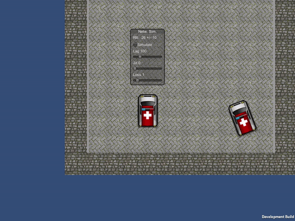

**With lag**
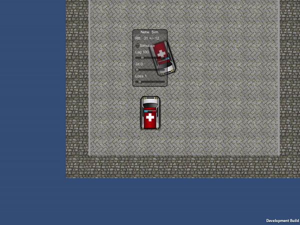

With a normal connection the remote car (shadow car) is nowhere to be seen which means we are almost on the remote position each time. Even when, after the connection is simulated to be really bad or a collision happens, the car is still smoothly moving around at the same pace it was with a good connection. The only problem comes when the car gets out of sync when the amount of network interference is high.

## Finding an optimal solution

Now that my first iteration of my car-synchronization code is finished I can add more things to test its flexibility. I want to create a boost for the car, adding gameplay and a way of increasing the car’s speed. I also want to add more objects with which the cars can collide.

**Car Boosting**

After working for a few hours on car boosts I noticed that the speed became a problem for synchronization. At higher speeds, the car would be too far behind the remote car causing desync problems. Currently I don't send velocity in my state synchronization, since cars move mostly at the same time, all the time. Now that I have boosts, the car 's speed can fluctuate very quickly and frequently. I can manage this by adding the same technique(dead reckoning algorithm) as I did with snapshot interpolation where I added the velocity times the lagg, to the remote position (see Figure 18).

