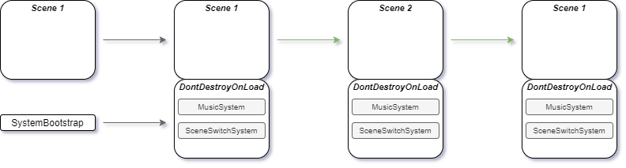
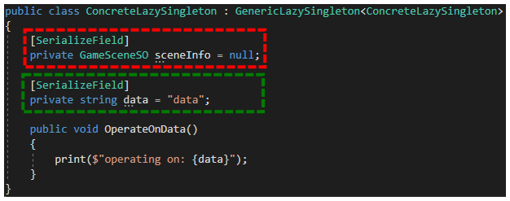

# A case against bad MonoBehaviour Singletons in the Unity Game Engine

During my work as a game developer in the Unity Game Engine, I have used a certain design pattern more so than any other. The Singleton Pattern is probably one of the easiest patterns out there. It is part of the category of creational patterns, meaning it is a pattern related to the creation of objects.

I have found, during my work, that there are some serious problems when using this pattern together with Unity’s MonoBehaviour class. In this essay I will give a short introduction of the singleton pattern, lay out it’s basic implementations and then argue why I think its short term ease of use is not worth the variety of problems it causes in later stages of development.

At the end I will give multiple alternative approaches which are more scalable and don’t run into the same problems default singleton implementations do.

## A short intro into the singleton pattern

The use of a singleton pattern is easily identified by the implementation of a static “instance” member variable. According to the pattern there can only be one instance available. In order to do this the instance variable is only set once, when it’s value is null.



The basis idea of the singleton pattern is to have this **one** instance provide a global connection for other objects to use.



Almost always when you are creating a game in Unity you want some component (mostly managers/systems/services) to be globally available for managing a single responsibility. Since the singleton pattern (unlike static classes) provides you with the option to derive from other classes, a singleton that derives from the monobehaviour class looks like the perfect solution.



Because of the way MonoBehaviour instances are created according to Unity’s [Anatomy of a Script File](https://docs.unity3d.com/Manual/CreatingAndUsingScripts.html), the instance value must now be assigned in the Awake method instead of the getter. If your script is attached to a game object in a scene and that scene is loaded, the Awake function will be called and can thus be used to either assign the instance or destroy the game object to which your singleton class is attached.

After assigning itself to the static instance variable, the DontDestroyOnLoad method is used to ensure that your singleton is persistent across multiple scenes. That is, it won’t be destroyed when a new scene is loaded.

## An indication of underlying problems

If you look at a real world example of a singleton implementation, at first there doesn’t seem to be anything wrong with the code. There are actually a lot of people providing code like this on websites like [github](https://github.com/Goodgulf281/Unity-Formation-Movement/blob/master/Scripts/Utilities/Singleton.cs), including myself I will say. But if you look closely, there seem to be some restrictive measures added to make sure everything works alright. Let's look at an example of this:



## The appIsQuitting flag

The appIsQuitting member variable is supposed to protect the script from throwing a MissingReferenceException. This can happen when other scripts try to access the singleton, after it has already been destroyed. Most of the time the code that causes these types of error’s resides inside the OnDestroy function, which is called when an object is being destroyed. This is why this value is set to true, in the singleton’s OnDestroy method. If appIsQuitting is true, a null reference can be returned instead of throwing this exception.

Sadly, this doesn’t really solve the issue at hand. It is still possible to get a MissingReferenceException if another script’s OnDestroy method is called before our singleton’s. You could manually change the [order of execution](https://docs.unity3d.com/Manual/class-MonoManager.html) though, an action that has to be undertaken each new project for each new singleton class and can also cause your code to be susceptible to errors that are hard to track down.

In addition, a null reference will still be returned, which needs to be taken care of. Be ready to provide all your code that uses this singleton with if statements and [null conditional operators](https://docs.microsoft.com/en-us/dotnet/csharp/language-reference/operators/member-access-operators#null-conditional-operators--and-) to handle this probable event.

## The isDuplicate flag

Another problem can and will probably occur when your singleton returns to the original scene it was put in. It is related to there being a duplicate which needs to be dealt with.

Unless you use some form of lazy initialization or bootstrap function or scene, which i will both cover later on, you can’t really avoid this conflict.

The first line of defense for this conflict resides inside the Awake function and is to either override the original singleton with the duplicate one or just destroy the duplicate. The latter is used most and will also be shown in this example:



The question here might be: what function does the isDuplicate flag serve here? Well, it is a response to another problem that happens when an object gets destroyed. Destroying an object in Unity using the Destroy method makes sure the object “is destroyed immediately after the current Update loop” according to the [Unity Documentation](https://docs.unity3d.com/ScriptReference/Object.Destroy.html). This means that any other code in Awake will still be executed. Even if the object is being destroyed. You could add a return statement after Destroying but it would still mean that a generic implementation of the singleton pattern in this way is pretty difficult..

Returning the base Awake function doesn’t stop the overridden implementation of the derived class to still execute:





You will now have to use the isDuplicate flag to check in your awake function if you can actually run the code. Don't forget you will have to do this for **each** new singleton implementation.

Having these kinds of limitations and constraints on development will definitely impact the product quality and the workflow.

## Other Development problems

Working with this default form of singleton behaviour, I encountered additional problems during development. These are problems that have a solution, but require the developer to do additional testing/research to provide that solution during development for each instance of a problem with an implementation.

### Rigid connections

Let's say you are creating a game. You created some enemies, a hero and some managers to handle popups, audio and pooling of game objects. You have your main menu scene, containing all your singleton objects. They are set to not be destroyed on load and thus you can use these managers in your battle scene, where the hero fights the enemies.

You have been getting some feedback from friends and you want to readjust some values inside your battle scene. You start up the battle scene and your console starts to turn red. Null reference errors. It seems your popup manager instance is null because it has not been created yet. After adding your popup manager you still get a null reference error. This time it is inside your popup manager. Your popup is supposed to make a sound but the audio manager is not created yet.

This typical scenario might be very much recognisable to some developers. This string of dependencies can make a pretty good day, pretty bad very quick. It also means, creating some sort of test environment is going to involve a lot of sighs and moans.

### Order of execution

Singleton behaviours just like any other monobehaviour class will need to initialize themselves.. Setting the instance variable will need to happen as soon as possible which happens in the Awake function. This leaves only the Start function open for other monobehaviour classes to interact with our singleton during initialization.

OnEnable sadly cannot be used for this if you look at the [Unity Execution order manual](https://docs.unity3d.com/Manual/ExecutionOrder.html). Awake and OnEnable are called on each object before start is called which means if your monobehaviour class is first in the script execution order its OnEnable function will still be called earlier than your singleton’s Awake. This means another restrained on code structure.

### Alternatives

Luckily there is a large variety of implementations for the singleton pattern in unity. Each solves at least one problem with the default implementation of a singleton, but in return comes with its own set of problems.

### Lazy initialization

Lazy initialization provides solutions to the problem of rigid connections, order of execution and the duplication problem.. It does this by providing an on demand version of the normal singleton behaviour. A simple example:



By creating the game object and assigning your instance member the added component value, the instance will always be available whenever it is needed. In the case of the rigid connection problem, it will first create the popup manager when it is needed and then create the audio manager since it will be needed for the popup manager to work. No need anymore to drag prefabs into test scenes or setting your singleton scripts to execute before the default time.

To top it off there is even a generic [Lazy class](https://docs.microsoft.com/en-us/dotnet/api/system.lazy-1?view=net-5.0) in the System namespace providing a flexible and easy to use implementation of this initialization method. This can be implemented for example like so:



But of course, it is not all positives. There is one major downside to this method. That is, it’s use of serialized fields. Because we are lazily instantiating this singleton, we can’t set scene or project references like with monobehaviours in scenes or prefabs. When our singleton game object is created, because we add the component to it, only the default values are copied. This means in this example, the data string contains the value data and sceneInfo will be null even if you set these values inside a prefab or scene.

I should say that there is atleast one way to circumvent this problem, but it is not a pretty one: using the Resources folder. This method is also used by another alternative and uses the Resources folder to load singleton prefabs into the scene during runtime. The not so pretty part is that you do this only once and the Resources folder is notorious for causing many problems when not used properly, as indicated by [Unity its Manual on the Resources folder](https://docs.unity3d.com/Manual/BestPracticeUnderstandingPerformanceInUnity6.html).

The way this is implemented is pretty easy. All you do is create a prefab of your singleton game object with your lazy singleton behaviour attached and its references set. Make sure it is inside a folder named “Resources”, then you use the Resources.Load method to Instantiate a copy of this prefab into the scene.



## The Bootstrap function

Using C# attributes, Unity provides a [RuntimeInitializeOnLoadMethodAttribute](https://docs.unity3d.com/ScriptReference/RuntimeInitializeOnLoadMethodAttribute.html) class. This attribute class is applicable to a function. This function will be called after Awake or based on the given [RuntimeInitializeLoadType](https://docs.unity3d.com/ScriptReference/RuntimeInitializeLoadType.html) value, based on the overloaded constructor you want to use. Using this attribute you can create a simple boot function that is executed only once during the whole application lifecycle and creates all managers/systems/services that you will need. This avoids the duplication conflict:

An example of this can be a SystemBootstrap class with only one bootstrap function:



Registering a system behaviour will load the prefab from a resources folder and use it to instantiate a copy in the active scene.



The reference to the system behaviour component is added to a dictionary to provide other scripts with global availability of the system.



Interacting with a scene switch system would then be done like this:



In addition to the fact that you will have to provide a resources folder with the different system prefabs, you will have to deal with the fact that, if not configured, **all** systems are created by default when the application starts. This might be annoying in some situations when you simply need to test a feature inside a test scene.

## The bootstrap/initialization scene

Another method which uses the same principle as the bootstrap function is a bootstrap or initialization scene. This scene will contain all persistent game objects that need to be created when the application is started.

You can use an editor only script to load this scene if it isn’t already. This way you can decide on whether you want your systems in your test scene or not.



## Scriptable Object Event System

There is another alternative, which solves many of the stated problems and has, as far as i have been able to test, only one downside. You can use a Scriptable Object Event System, in this case, for the purpose of providing a way of communication between manager and Actor behaviours as far as I can see it. You create channels (e.g. class SceneLoadEventChannel : ScriptableObject) that contain only two things. An event containing the arguments necessary for the channel to work and a function that raises the event.



A manager can listen to this channel through subscription and Actor behaviours can raise events to let the manager know something has to be managed.





The nice thing about this relationship is that the channel creates a loose connection between manager and actor. A manager doesn’t have to be in the scene when an event is raised as part of some action an actor is doing. In addition to this, channels are easily created and referenced since the scriptable object is a project asset which can be referenced from anywhere.

The downside however is that interaction between manager and actors is limited to raising events.

Shared data will have to be stored in things like scriptable objects to provide actors with management information when necessary (e.g. whether a popup is active or audio is playing).

## Conclusion

The default implementation of a singleton in Unity provides the developer with a lot of unnecessary challenges. Flags like appIsQuitting and isDuplicate don’t fix the underlying problems like script execution order, order of execution for event functions and the way Unity handles the lifecycle of game objects. Luckily, alternative solutions to this problem exist.

Lazy initialization provides the developer with the opportunity to create singleton objects on demand, solving the problem of rigid connections and order of execution, but needs to use the notorious Resources folder to provide the necessary functionality of editor exposed fields.

The bootstrap function provides the developer with the option to create all singleton objects at boot time and only once, solving the issue of duplication when returning to the starting scene. It does also need a Resource folder to provide it with the necessary resources to Instantiate these singleton objects making it a little less attractive.

The bootstrap/initialization scene is also very clear in solving the issue of duplication of singleton objects. It does this by grouping the necessary systems inside an “initialization or bootstrap” scene, which is used to start your application from, but can also be loaded into a test scene if necessary.

Lastly there is the Scriptable Object Event System approach where no singleton pattern is used, but channels create a loose connection between managers and actors, where the managers listens for events or requests and the actors can raise an event or request to make the managers do its job. The downside to this approach is that management data can not be exposed through the singleton instance and thus needs to be shared in some other way (e.g. scriptable objects).

My conclusion therefore is: There is no one solution, there are just good alternatives.

## References

1. Benjamin van der Wolf. “System Bootstrapping” Accessed January 28, 2021. https://github.com/Bvanderwolf/BWolfPackages
2. Dino Fejzagić. “service locator” Accessed January 28, 2021. https://medium.com/medialesson/simple-service-locator-for-your-unity-project-40e317aad307
3. Goodgulf281. “github - Singleton” Accessed January 28, 2021. https://github.com/Goodgulf281/Unity-Formation-Movement/blob/master/Scripts/Utilities/Singleton.cs
4. Unity. “Execution order for event functions” Accessed January 28, 2021. https://docs.unity3d.com/Manual/ExecutionOrder.html
5. Unity. “Script execution order” Accessed January 28, 2021. https://docs.unity3d.com/Manual/class-MonoManager.html
6. Unity. “Anatomy of a Script File” Accessed January 28, 2021. https://docs.unity3d.com/Manual/CreatingAndUsingScripts.html
7. Microsoft. “Lazy class” Accessed January 28, 2021. https://docs.microsoft.com/en-us/dotnet/api/system.lazy-1?view=net-5.0
8. Unity. “Resources folder”Accessed January 28, 2021. https://docs.unity3d.com/Manual/BestPracticeUnderstandingPerformanceInUnity6.html
9. Unity. “RuntimeInitializeOnLoadAttribute” Accessed January 28, 2021. https://docs.unity3d.com/ScriptReference/RuntimeInitializeOnLoadMethodAttribute.html
10. Unity. “RuntimeInitializeLoadType” Accessed January 28, 2021. https://docs.unity3d.com/ScriptReference/RuntimeInitializeLoadType.html
11. Unity. “Scriptable Object Event System channels” Accessed January 28, 2021 https://www.youtube.com/watch?v=ukE73ifSrTM&list=PLX2vGYjWbI0S6CnkDm0AwVgA6E6L_vJNf&index=9&t=2324s
