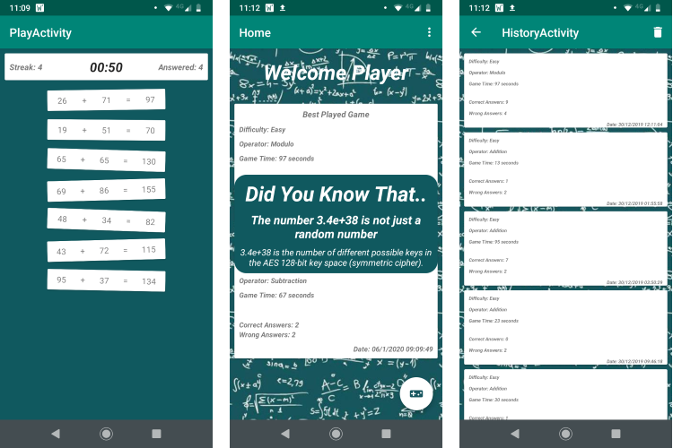

# Math Recycler

Developed with kotlin in android studio, the mathrecycler is a simple game where you make decisions swiping a math statement right or left, asserting it to be true or false. You are able to customize difficulty and math operator and look at played games in your history list.

---

During the project I used a variety of libraries and techniques:
- Activities and Fragments
- ROOM local storage with Repositories
- Viewmodels and LiveData
- Remote data using the NumbersAPI
- Animations using Lottie Animation