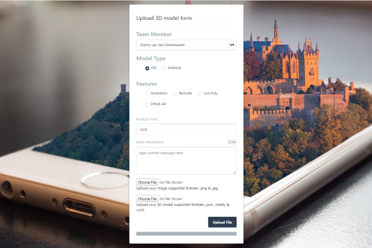

Made using github pages with 4 other students at the University Of Applied Sciences in Amsterdam, this project was my first ever web development project. It was part of a 3 part system architecture. It's purpose was to upload 3D models to the github repository through the github API. Another website could then fetch these models and show them in Augmented Reality on the web

---

During the project I used a variety of libraries and techniques:
- VueJs
- Git for version control
- Github REST API
- Bootstrap