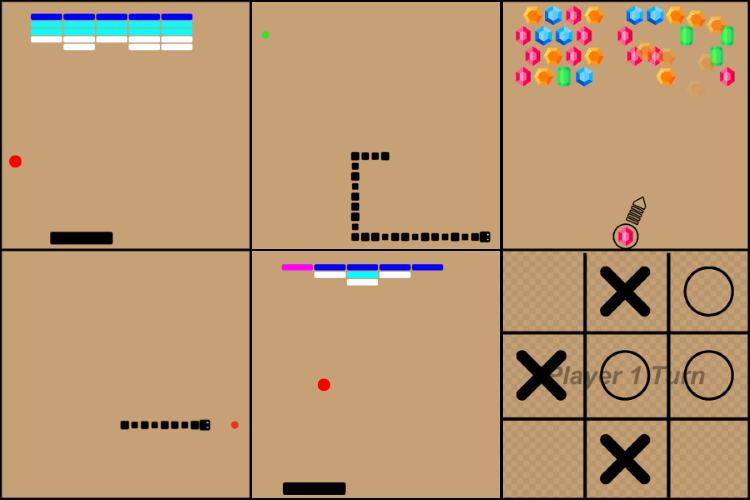

Developed in Unity Engine, this is the first hobby project I finished. It contains 4 games: Snake, Breakout, MatchThree and TicTacToe. It also contains a menu from where you can pick the game you want to play. Programmed in C#, this project was meant to try to out some new techniques I had learned.

---

During the project I used a variety of libraries and techniques:
- Singleton Pattern
- Generics
- C# events
- C# delegates, lambda and anonymous functions