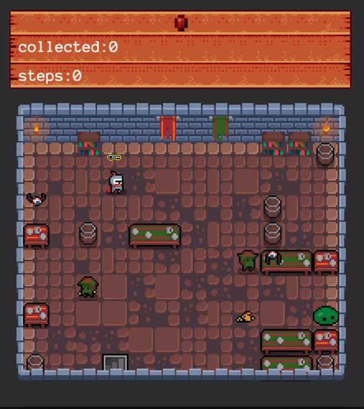

# So Long

In the game you play as a knight who's goal it is to collect all gold and a key before running to the exit. In the meanwhile, enemies are walking around to prevent you from obtaining your collectables and finishing the game.



