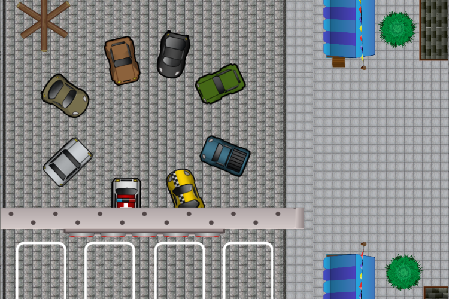

# Multiplayer Racer

How do I create a 2d multiplayer racing game with lag and packet loss compensation and desync-avoidance? This was the research question I posed for a school assignment I did as a GameDevelopment student at the University Of Applied Sciences in Amsterdam. To find this out i took a look at the Photon Unity3D Networking Framework and created a project using Photon for the Unity Engine, to research this very topic.

During the project I researched a variety of subjects:
- Multiplayer programming using the Photon Framework
- DeadReckoning
- 2D Game Development in Unity



