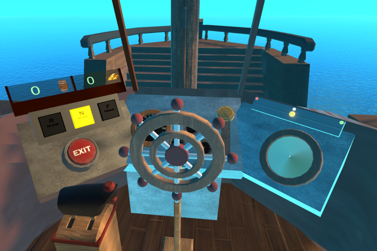

# The Boat Game

As an intern at the ING Tech Research & Development department in Amsterdam I was able to learn about VR and Networking in Unity through creation of a teambuilding game called "The Boat Game". Its purpose was to bring toghether teammembers by placing them on a virtual boat, assigning them different roles and confronting them with various of challenges.

In The Boat Game, all players are assigned a role on a ship after which the crew has complete a variety of quests while remaining afloat. This game's first version was build together with another intern and an employee at ING after which another intern group juiced up the game with animations, updated models and VFX.

---

During the project I used a variety of libraries and techniques:

Multiplayer programming using the Photon Framework
VR development in Unity using SteamVR
Git for version control
Trello for workflow
During this time I also wrote a research paper on delegates in C#

